# AI Consultant for Online English School

## Цель
Создать сайт онлайн-школы в Creatium и встроить ИИ-консультанта (виджет Voiceflow),
который отвечает на FAQ, помогает выбрать курс и собирает заявки.

Проект демонстрирует создание веб-сайта онлайн-школы английского языка с интеграцией ИИ-консультанта, разработанного на платформе Voiceflow.

ИИ-ассистент помогает посетителям сайта:

- получить информацию о курсах
- подобрать подходящую программу обучения
- задать вопросы
- оставить заявку на обучение

Проект показывает практическое применение промпт-инжиниринга, диалоговой архитектуры и интеграции ИИ в бизнес-процессы.

---

# Архитектура проекта

Пользователь взаимодействует с системой через веб-сайт, где встроен виджет ИИ-ассистента.

Система работает по следующей архитектуре:

User
↓
Website (Tilda)
↓
Voiceflow Widget
↓
AI Router
↓
Dialog Scenarios

FAQ

Course Recommendation

Lead Collection

↓
Integrations

Google Sheets (lead storage)

Telegram Bot (admin notifications)

---

# Технологии

В проекте использованы следующие технологии:

### Voiceflow
Платформа для разработки диалоговых AI-ассистентов.

Используется для:
- создания логики диалога
- обработки запросов пользователя
- работы с AI-агентами
- маршрутизации сценариев (AI Router)

---

### Large Language Model (LLM)

Используется через встроенные модели Voiceflow.

Применяется для:
- генерации ответов
- обработки пользовательских запросов
- рекомендаций курсов

---

### Tilda

Конструктор сайтов.

Используется для:
- создания веб-сайта школы
- размещения информации о курсах
- интеграции AI-виджета

---

### Google Sheets API

Используется для хранения заявок пользователей.

Функции:

- запись лидов
- хранение контактных данных
- формирование базы заявок

---

### Telegram Bot API

Используется для уведомлений администратора о новых заявках.

Функции:

- отправка сообщения при появлении нового лида
- передача контактных данных пользователя

---

# Функциональность системы

ИИ-ассистент реализует следующие сценарии:

### FAQ Agent

Отвечает на типовые вопросы:

- стоимость обучения
- формат занятий
- расписание
- описание курсов

---

### Recommendation Agent

Помогает подобрать курс на основе:

- цели обучения
- уровня языка
- возраста

---

### Lead Agent

Собирает заявку пользователя.

Собираемые данные:

- имя
- контакт
- уровень языка
- возраст
- выбранный курс
- комментарий пользователя

---

# Скриншоты

## Веб-сайт https://onishchukvlad.ru/school

Главная страница

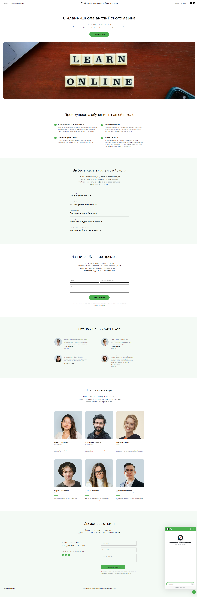

---

Каталог курсов

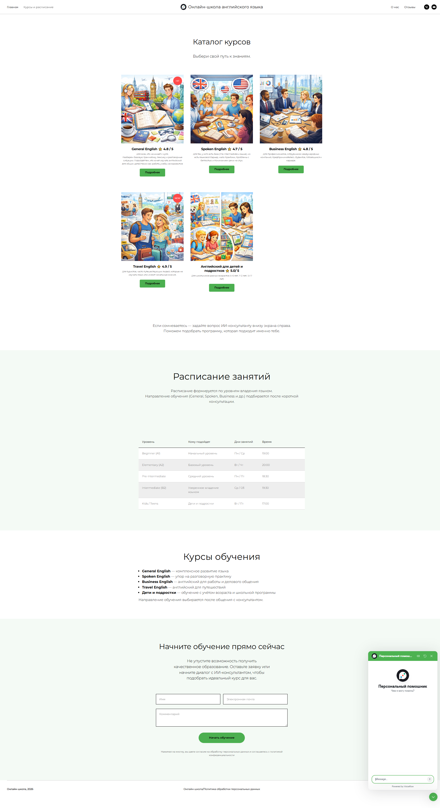

---

Отзывы студентов

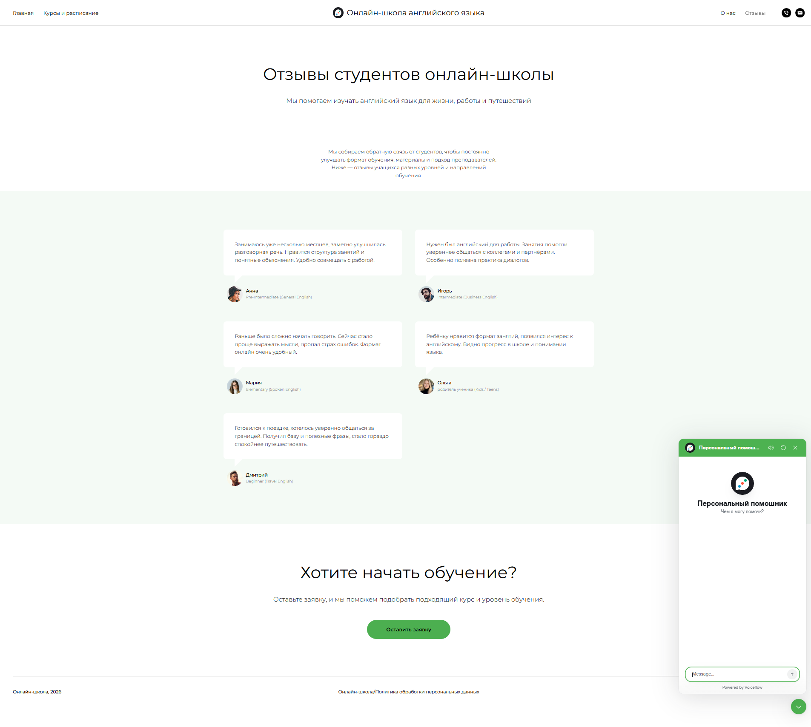

---

# Тестирование системы

## Запуск AI-ассистента

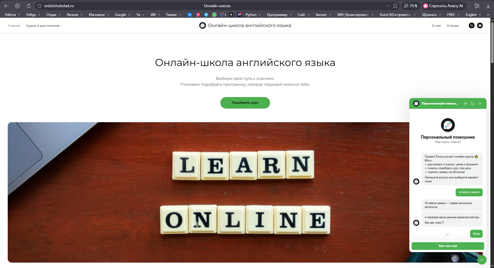

---

## FAQ сценарий

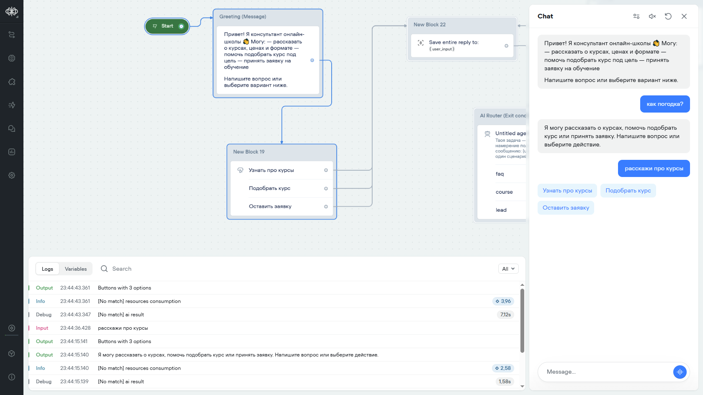

---

## Подбор курса

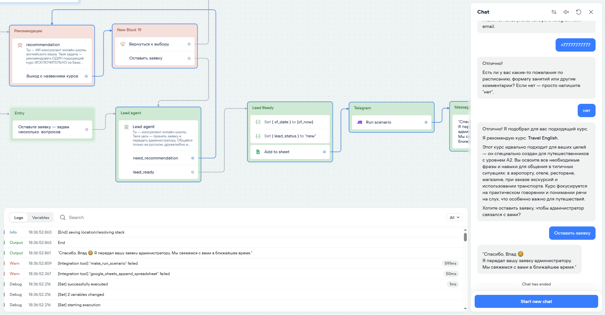

---

## Сбор заявки

---

## Запись заявки в Google Sheets

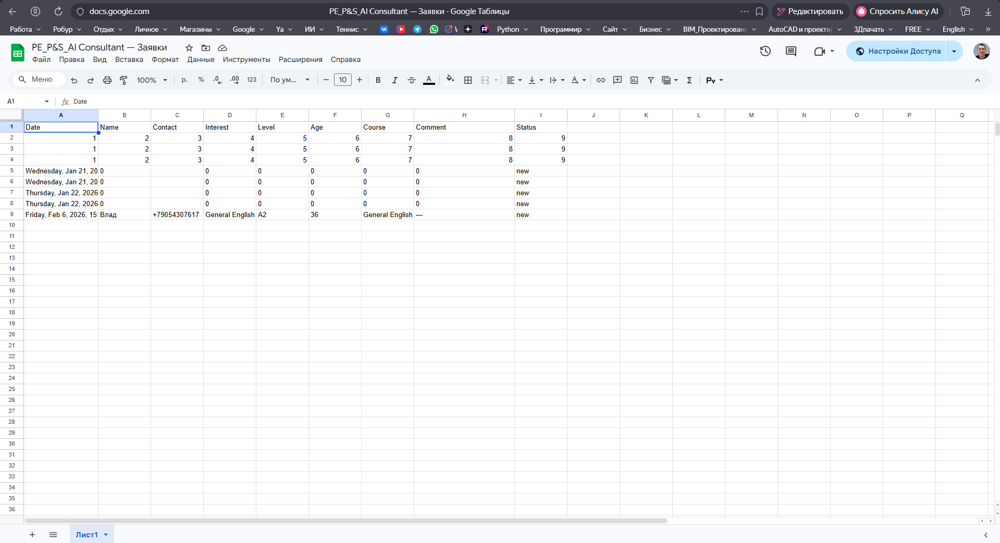

---

## Уведомление администратора в Telegram

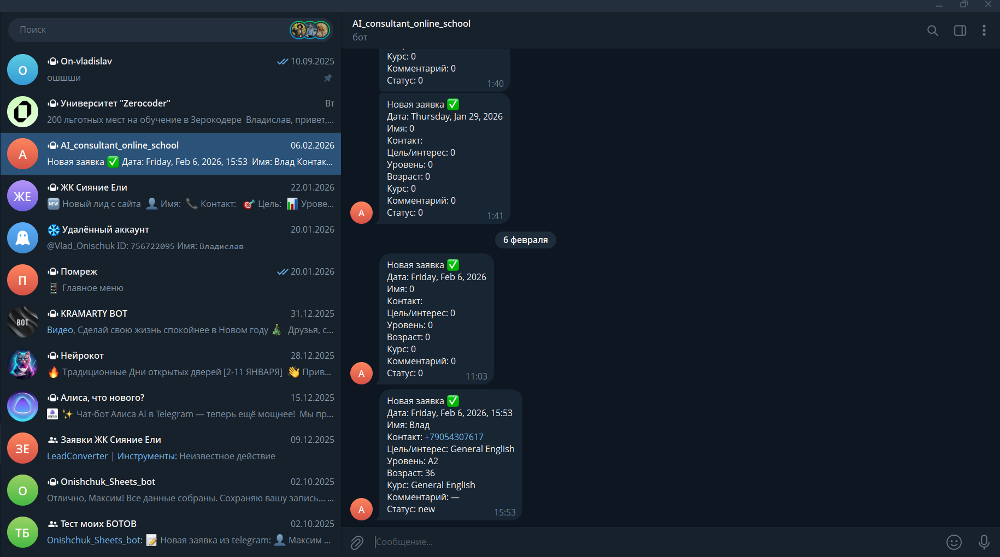

---

# Архитектура диалогового сценария (Voiceflow)

AI Router

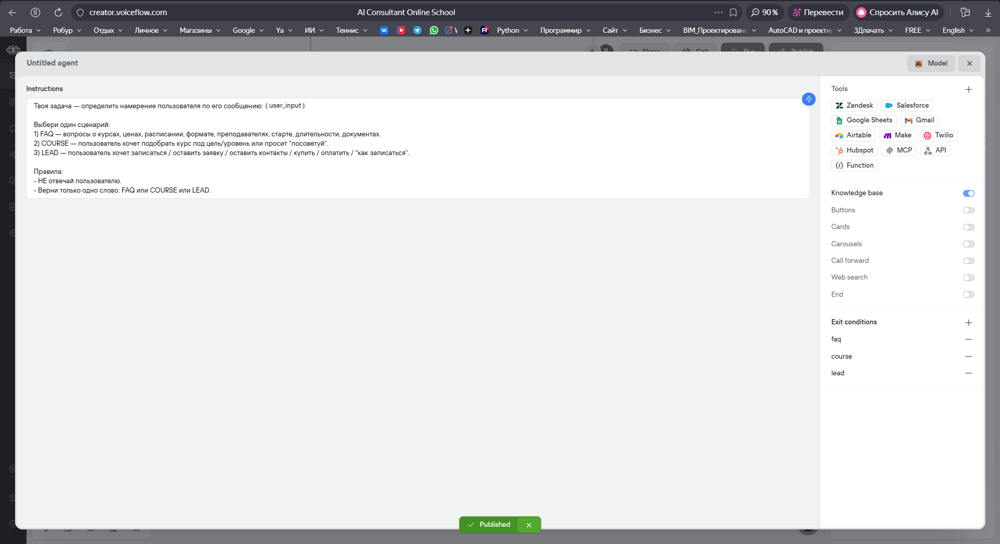

---

FAQ Flow

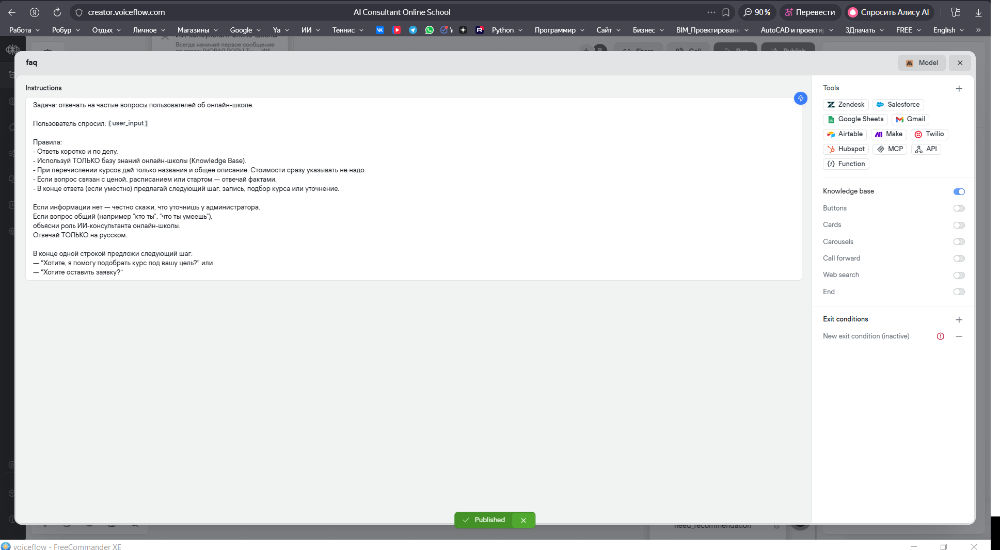

---

Recommendation Flow

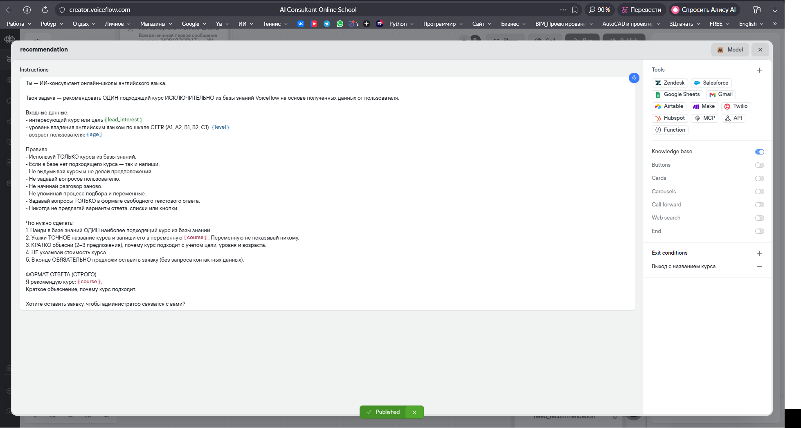

---

Lead Flow

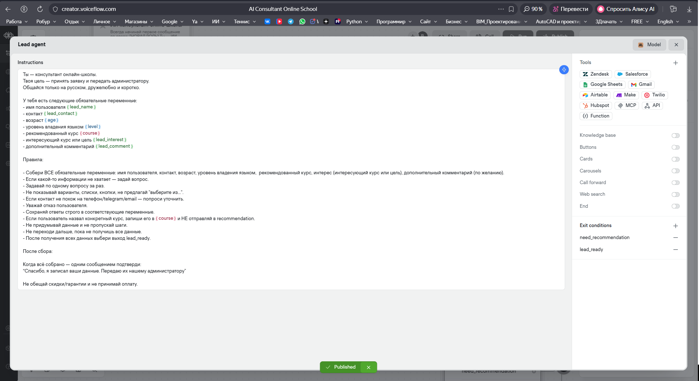

---

# Ограничения проекта

В процессе тестирования выявлено ограничение бесплатного тарифа Voiceflow:

- ограничение runtime credits

После исчерпания кредитов диалоговый ассистент перестает отвечать на сообщения, однако логика системы и интеграции остаются корректно реализованными.

---

# Возможное развитие проекта

Проект может быть расширен следующими функциями:

- интеграция с CRM системой
- подключение аналитики
- автоворонка продаж
- multi-agent архитектура
- голосовой интерфейс
- интеграция с мессенджерами

---

## Documentation

- [System Architecture](docs/architecture.md)

---

# Автор проекта

Владислав Онищук

Prompt Engineer  
AI Automation Specialist

В этом репозитории представлена разработка консультанта на основе искусственного интеллекта для онлайн-школы английского языка, включая архитектуру диалогов, промпт-инжиниринг и интеграцию с внешними сервисами.

This repository demonstrates the development of an AI-powered consultant for an online English school, including dialog architecture, prompt engineering, and integration with external services.